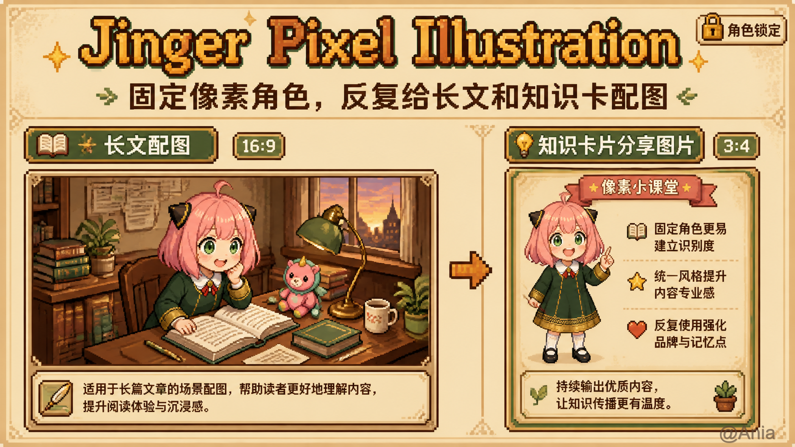
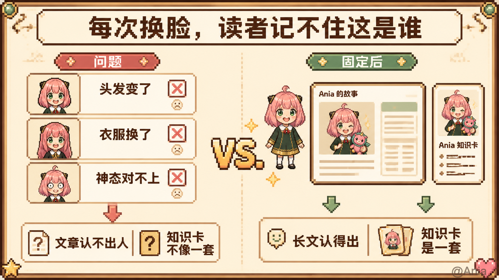
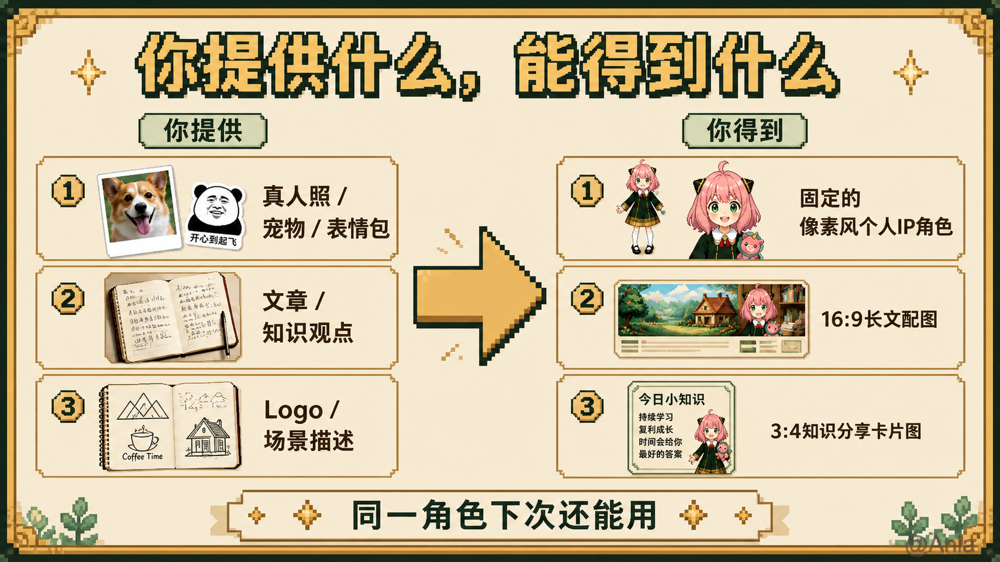
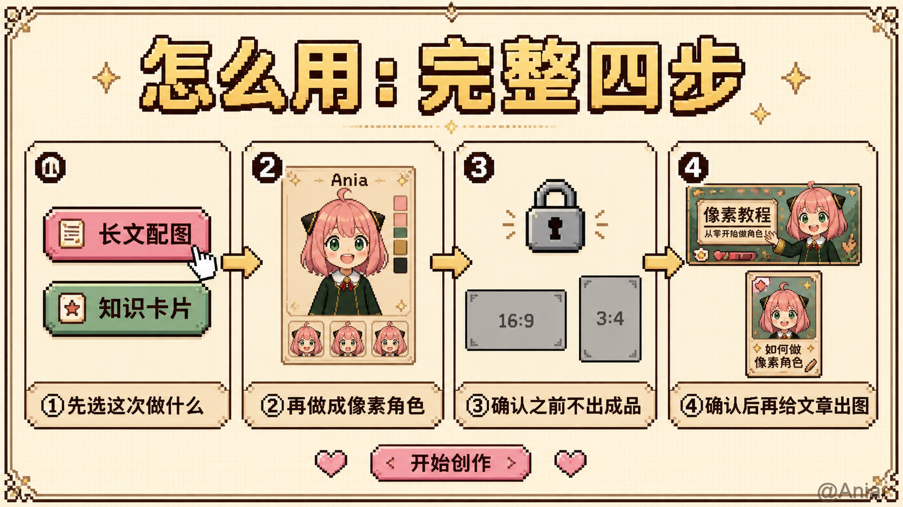
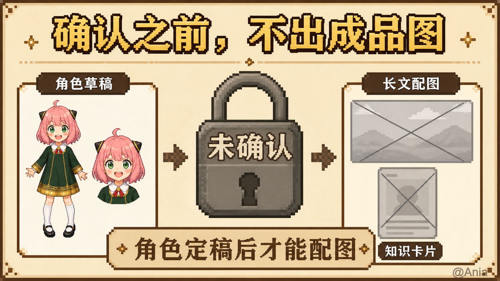
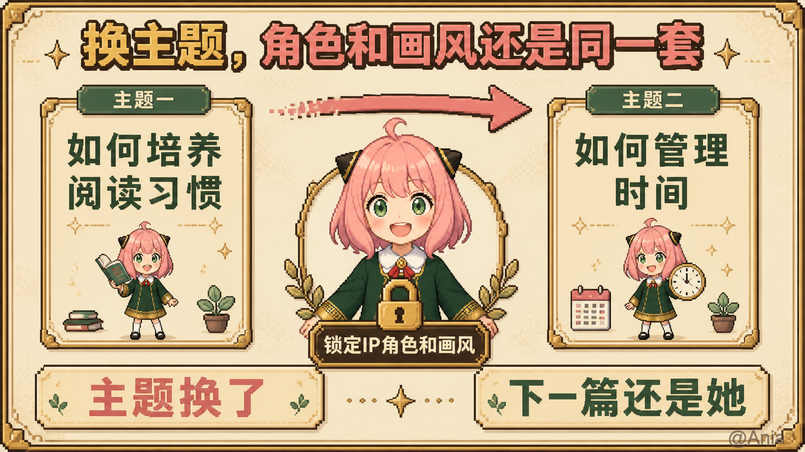

# Jinger Pixel Illustration

高清像素个人 IP 插图 Skill。

先固定一个高清复古像素角色（不一定是真人：宠物、表情包、动漫、品牌 IP 都可以），再做成两种图：

1. **16:9 长文配图**：必须有封面 + 正文图。封面用暖色简单像素场景，正文默认白底迷你剧场。
2. **3:4 知识卡片**：整张由生图模型画成像素场景，人物和短文字一起演戏。最多 9 张。

不要默认两套一起出。没有确认角色之前，不要配图。

## 和别人的差别

大多数开源 IP skill 是简笔画 / 扁平 3D / 小黑手绘，而且通常只做长文配图。这套是：

- 高清像素
- 长文 + 知识卡片两种形态
- 卡片必须人字互动；整张生图像素场景，不是 HTML 排版卡

## 仓库结构

这个仓库**本身就是 Skill**。GitHub 打开就能看到本 README；克隆后目录名改成 `jinger-pixel-illustration` 即可安装。

```text
.
├── README.md              ← 你现在看的这份
├── SKILL.md               ← Agent 入口
├── LICENSE / LICENSE-ASSETS
├── PLAN.md                ← 设计笔记
├── assets/                ← Jinger 画风锁 + 作者示范图（不是给你当脸用）
├── docs/how-to/           ← README「怎么用」流程说明图
├── examples/
│   ├── jinger/            ← 作者示范设定（配合 assets/）
│   └── example-character/ ← 虚构 Mina 填写示例（暂无图）
├── references/            ← 创建角色 / 概念→画面 / 长文 / 卡片细则
├── scripts/               ← 安装脚本 + 本地角色包管理
└── templates/             ← 仅无生图时的应急占位
```

你自己的照片、角色包、成图放本地 `.jinger-pixel-assets/`（已 gitignore），不要提交到本仓库。`docs/how-to/` 里是给 README 看的流程说明图，例外。

## 安装

### 方式一：通用 Skills CLI（推荐）

```bash
npx skills add rebecha1227-a11y/Jinger-Pixel-Illustration -g -y
```

### 方式二：本仓库 npx 脚本

会把 Skill 装到本机的 Cursor / Claude Code / Codex skills 目录：

```bash
npx github:rebecha1227-a11y/Jinger-Pixel-Illustration
```

只装其中一个客户端：

```bash
npx github:rebecha1227-a11y/Jinger-Pixel-Illustration --cursor
npx github:rebecha1227-a11y/Jinger-Pixel-Illustration --claude
npx github:rebecha1227-a11y/Jinger-Pixel-Illustration --codex
```

### 方式三：git clone

Claude Code / Codex：

```bash
git clone https://github.com/rebecha1227-a11y/Jinger-Pixel-Illustration.git \
  "${HOME}/.claude/skills/jinger-pixel-illustration"
```

Cursor：

```bash
git clone https://github.com/rebecha1227-a11y/Jinger-Pixel-Illustration.git \
  "${HOME}/.cursor/skills/jinger-pixel-illustration"
```

已有文件夹时，也可以把本仓库复制进去，**目录名保持** `jinger-pixel-illustration`。

## 怎么用

先说一句：**没有「试用示范角色」入口。** 仓库里的 Jinger 图是作者示范 + 画风锁。请创建你自己的角色，水印用你自己的号。



### 为什么要先固定角色

每次换脸，读者记不住；固定成同一套像素 IP 后，长文和知识卡才像一个人写的。



### 你要提供什么

至少准备一类「画谁」的素材，再加这次要配的内容：

| 你给 Skill | 说明 |
|---|---|
| 角色参考 | 真人照、宠物、表情包、动漫/插画角色、品牌 IP、已有设定图，任选；要你有权用 |
| 这次做什么 | 只要长文 / 只要知识卡片 / 两套都要 |
| 长文 | 文章全文，或本地 Markdown / 网页正文 |
| 知识卡主题 | 要讲清楚的几个观点（卡片会先出 shot list） |
| 可选加料 | 产品 Logo、产品图、场景描述、气质词、水印号、特殊要求 |

没有确认角色之前，不会开始配图。

### 你会得到什么

| 成品 | 规格 |
|---|---|
| 像素角色包 | 干净全身（或头身锚点）+ 半身/头身 + 设定文字；三视图可选 |
| 16:9 长文套图 | **1 张封面 + 若干正文图**。封面是暖色简单像素场景；正文按这一张要讲什么来画（迷你剧场或说明图） |
| 3:4 知识卡片 | 默认 6–8 张，最多 9 张。整张像素场景，角色和短文字一起演戏 |
| 水印 | 每张右下角后盖，文案来自你的角色设定，不是 AI 画上去的 |



同一套像素角色可以反复给下一篇文章 / 下一套卡片用。

### 怎么走

1. **选成品**：只要长文 / 只要知识卡片 / 两套都要。没说清不会默认两套都出。
2. **定角色**  
   - A. 已有现成形象 → 发图  
   - B. 用参考素材创建 → 真人照、宠物、表情包、动漫、品牌 IP 都可以  
3. **确认门闩**：先看干净全身 + 半身。说「确认」才进入配图。三视图/设定板是可选项，不要也可以。
4. **出图**  
   - 长文：直接按文章生成封面 + 正文图  
   - 知识卡片：先出 shot list，你点头再生图
5. **可复用**：下次换文章或换主题，还是同一个像素角色。







## 无生图时

Skill 会交出完整 prompt、参考图路径和水印计划，不会假装图片已经生成。

## 授权

- 工作流、脚本、模板、文档：MIT，见 [LICENSE](LICENSE)
- Jinger 角色图与设定：不在 MIT 内，见 [LICENSE-ASSETS](LICENSE-ASSETS)

## 致谢

工作流结构参考了 [adrianpunk/punk-ip-illustrations](https://github.com/adrianpunk/punk-ip-illustrations)、[helloianneo/ian-xiaohei-illustrations](https://github.com/helloianneo/ian-xiaohei-illustrations)、[EverettFish/ip_illustration_for_yourself](https://github.com/EverettFish/ip_illustration_for_yourself)。
